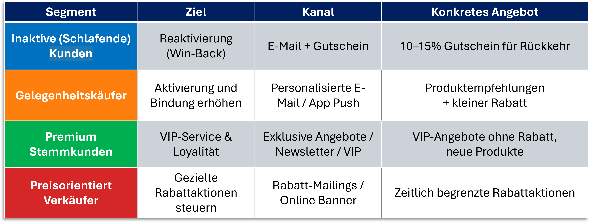
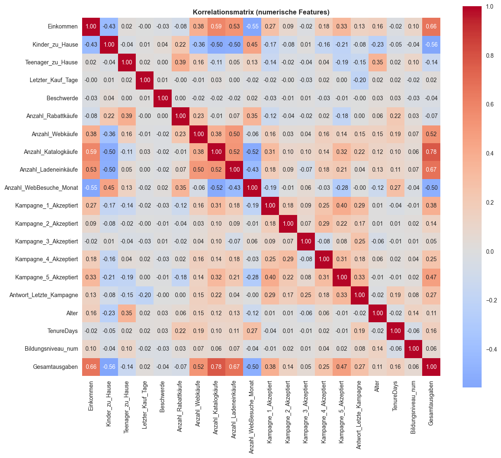
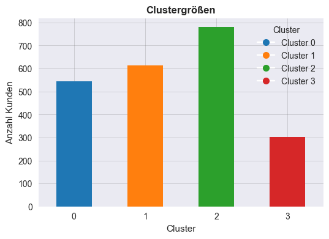
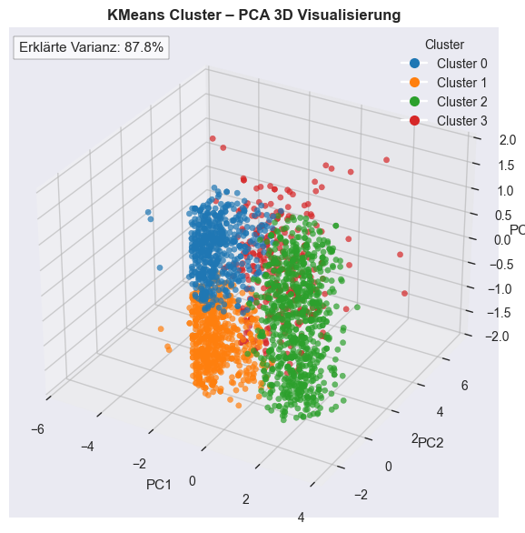
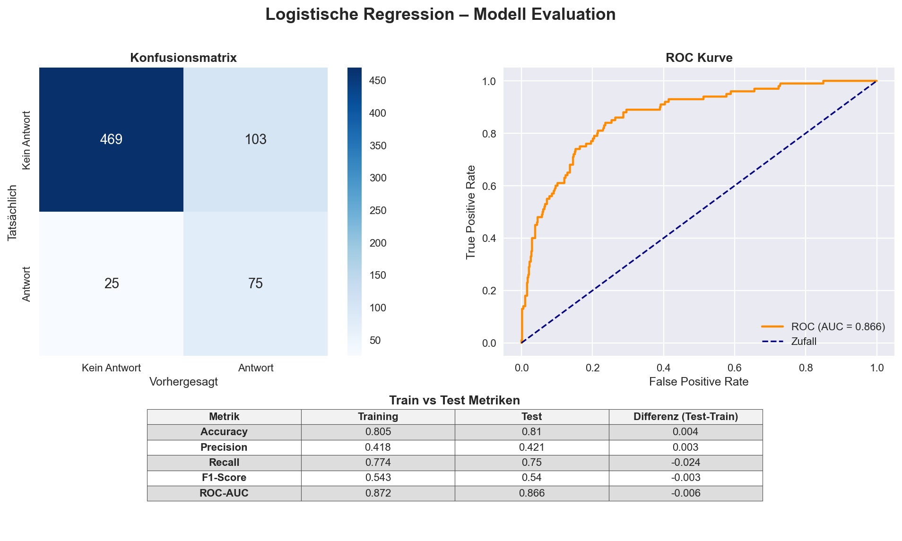

# Kundenanalyse & Marketingstrategie mit Machine Learning

## Projektübersicht

Dieses Projekt analysiert Kundendaten eines Unternehmens, um Marketingkampagnen datenbasiert zu optimieren.

Mithilfe von Machine Learning, Clusteranalyse und explorativer Datenanalyse wurden Kundenverhalten, Kaufmuster und Reaktionswahrscheinlichkeiten untersucht.

Das Ziel des Projekts besteht darin, personalisierte Marketingstrategien zu entwickeln und die Effizienz von Kampagnen zu erhöhen.

---

## Projektpräsentation

📄 Die vollständige Projektpräsentation:

[PDF-Präsentation öffnen](presentation/marketingkampagne_praesentation.pdf)

---

## Projektdateien

📓 Jupyter Notebook

Die vollständige Analyse, Datenaufbereitung und Modellierung befinden sich im Ordner:

notebooks/

📊 Datensatz

Der verwendete Datensatz befindet sich im Ordner:

data/

## Verwendete Technologien

* Python
* Jupyter Notebook
* Pandas
* NumPy
* Matplotlib
* Seaborn
* Scikit-learn
* PCA (Principal Component Analysis)
* K-Means Clustering
* Logistic Regression

---

## Datengrundlage

Der Datensatz enthält Informationen über:

* demografische Merkmale
* Kaufhistorie
* Webaktivitäten
* frühere Kampagnenreaktionen
* Produktpräferenzen

Die Daten wurden bereinigt, transformiert und für die Modellierung vorbereitet.

---

## Projektziele

* Analyse des Kundenverhaltens
* Identifikation wichtiger Einflussfaktoren
* Vorhersage der Kampagnenreaktion
* Kundensegmentierung mit Clusteranalyse
* Entwicklung datenbasierter Marketingstrategien

---

## Machine-Learning-Modell

Zur Vorhersage der Kampagnenreaktion wurde eine logistische Regression verwendet.

### Modellbewertung

| Metrik    | Ergebnis |
| --------- | -------- |
| Accuracy  | 0.81     |
| Precision | 0.42     |
| Recall    | 0.75     |
| F1-Score  | 0.54     |
| ROC-AUC   | 0.866    |

Das Modell zeigt eine gute Fähigkeit zur Identifikation potenziell reagierender Kunden.

---

## Kundensegmente

Die Clusteranalyse identifizierte vier zentrale Kundengruppen:

1. Inaktive Kunden
2. Gelegenheitskäufer
3. Premium-Stammkunden
4. Preisorientierte Käufer

Für jedes Segment wurden konkrete Marketingmaßnahmen entwickelt.

---

## Strategische Marketingempfehlungen

Basierend auf der Kundensegmentierung wurden für jede Kundengruppe individuelle Marketingmaßnahmen entwickelt.



---

## Projektstruktur

```text
data/               → Datensatz
notebooks/          → Jupyter Notebook
presentation/       → Projektpräsentation
images/             → Visualisierungen
```

---

## Wichtigste Erkenntnisse

* Einkommen korreliert stark mit den Gesamtausgaben
* Frühere Kampagnenreaktionen erhöhen die zukünftige Erfolgswahrscheinlichkeit
* Premium-Kunden reagieren anders als rabattorientierte Käufer
* Personalisierte Kampagnen sind effizienter als Massenmarketing

---

## Business Value

Durch datengetriebene Kundensegmentierung können:

* Marketingkosten reduziert werden
* Conversion Rates steigen
* Kundenbindung verbessert werden
* unnötige Rabatte vermieden werden

---

## Dateien

* Datensatz im CSV-Format
* Jupyter Notebook mit vollständiger Analyse
* Präsentation mit Business Insights

---

## Autorin

Nataliia Melnytska

Data Analytics | Machine Learning | Marketing Analytics

---

## Visualisierungen

### Korrelationsmatrix



---

### Clusteranalyse



---

### PCA 3D Visualisierung



---

### ROC-Kurve



---

## Projektdateien

### Präsentation

Die vollständige Projektpräsentation befindet sich im Ordner:

```text
presentation/
```

### Jupyter Notebook

Die vollständige Analyse, Datenaufbereitung und Modellierung befinden sich im Ordner:

```text
notebooks/
```

### Datensatz

Der verwendete Datensatz befindet sich im Ordner:

```text
data/
```
